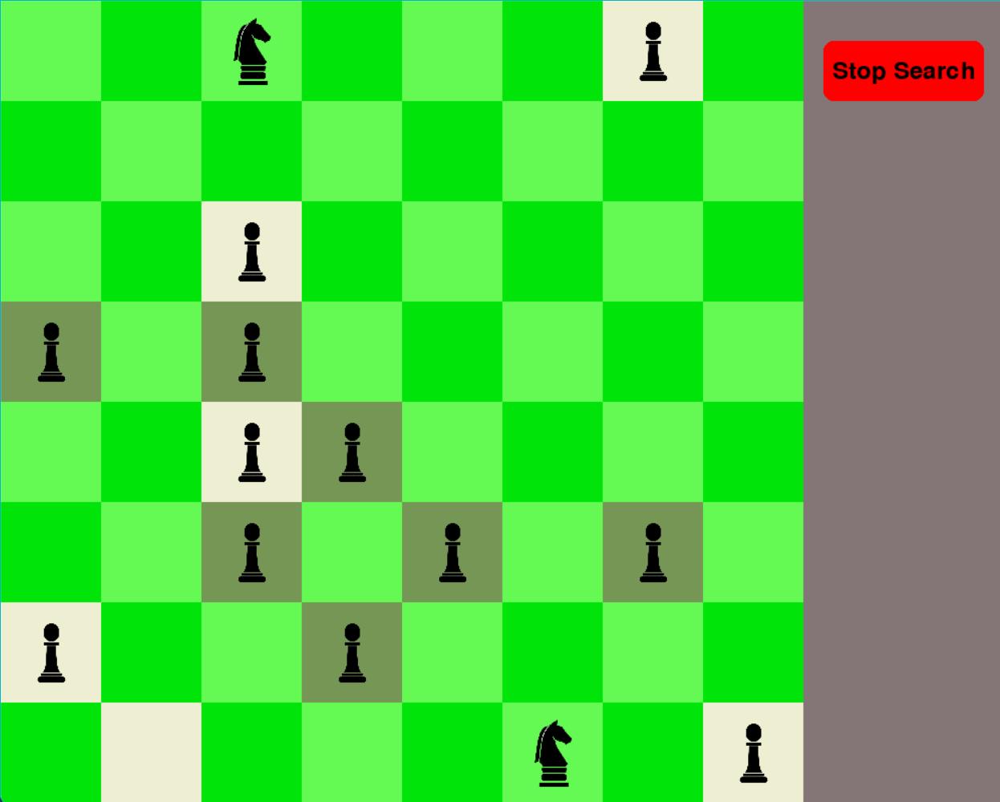

# Knight_algorythm
## Problem
A knight's tour is a sequence of moves of a knight on a chessboard such that the knight visits every square exactly once. If the knight ends on a square that is one knight's move from the beginning square (so that it could tour the board again immediately, following the same path), the tour is closed (or re-entrant); otherwise, it is open.
My problem is more complicated because the computer is randomly placing 12 pawns and the task of the knight is to find the path which helps the figure to visit every square exactly once.
## Algorithm
The algorithm is based on the Warnsdorff algorithm with Backtracking.
The algorithm in the program works, but it is very slow, unfortunately, due to the immense number of knight's moves possibilities. The Knight's Tour problem is classified as NP-hard, which means it is a non-linear problem in which we can only try to speed up the process of finding the optimal path.

The algorithm itself, after calculating the entire board, returns whether it is possible to complete all moves or not. Due to the very long computation time for all possibilities, I introduced an additional functionality that stops the program as soon as a path is found that is missing 4, 3, 2, or even just one square. This is to demonstrate that I can provide the current path taken by the knight, and the number of covered squares, and if a solution is not found within the first 10 seconds, it is highly likely that the given board configuration will not cover all squares. However, if we remove this additional functionality and wait for the calculations to complete, we can honestly determine whether it is possible to solve the Knight's Tour problem.

## Development
As I mentioned before, there is a way to make the algorithm a little faster. But due to the non-linearity of the problem it can be only achieved by trial and error method. Random position of the pawns and knight is not helping also, because it creates situations where there is no perfect solution, thus the additional functionality to stop the algorithm near the finish.
Finally, we could use a better CPU, or try to work the program on GPU, trying to check all 5 paths from the certain box on the board.

## Example

